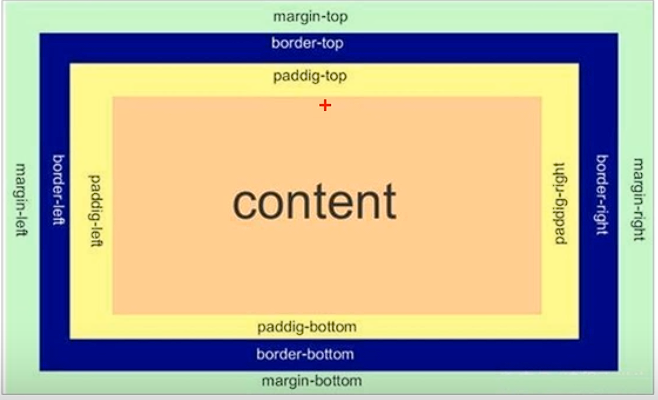

### 一、CSS语法
* **CSS语法：** `选择器 { 属性: 值; }`, 可以通俗的理解成`给谁改样式 { 改什么属性为什么值 }`
### 二、选择器
* **1.标签选择器:** 以HTML标签为选择器，例如`h1 { color: red; }`，表示所有h1标签的文字颜色为红色
* **2.类选择器:** 以类名为选择器，例如`
`，表示所有class为box的div标签，在css中使用方法为`.box { xxx: xxx; }`
  * **特殊用法：多类名：** `
`，表示所有class为box1 box2的div标签，在css中使用方法为`.box1.box2 { xxx: xxx; }`
* **3.ID选择器:** 以ID为选择器，例如`
`，表示所有ID为box的div标签，在css中使用方法为`#box { xxx: xxx; }`
  * id选择器只能有一个，不能重复，而类选择器可以有多个，重复的类名会被覆盖
* **4.通配符符选择器:** `*`，表示所有标签，例如`* { xxx: xxx; }`是将所有标签的样式都设置为xxx
* **后代选择器:** 例如：`.box .box-item`, `

`，表示box类下的box-item类
* **子代选择器:** 例如：`.box > .box-item`,`

`，表示box类下的box-item类
* **并集选择器:** 例如：`.box, .box-item`,`

`，表示box类和box-item类
* **伪类选择器:** 
  * 链接伪类选择器: `a:link`, `a:visited`, `a:hover`, `a:active` 分别表示未访问的链接、已访问的链接、鼠标悬停的链接、正在点击但没摁下鼠标的链接。
   为了确保上述选择器能够正常生效，最好是按顺序声明。
   `a`链接在浏览器中有默认样式，因此实际工作需要给链接单独制定样式。
  * 表单伪类选择器: `input:focus`, `input:hover`, `input:active` 分别表示正在获取焦点的表单、鼠标悬停在表单上、正在点击但没摁下鼠标的表单。
### 三、字体样式
* **1.font-family:** 设置字体，例如`font-family: "微软雅黑";` 
* **2.font-size:** 设置字体大小，例如`font-size: 16px;` 其中标题标签需要另外设置字体大小，例如`h1 { font-size: 24px; }`
* **3.font-weight:** 设置字体的粗细，例如`font-weight: bold;`
  * **值：** `normal | bold | lighter | 100 | 200 | 300 | 400 | 500 | 600 | 700 | 800 | 900`
* **3.font-style:** 设置字体的样式，例如`font-style: italic;`
  * **值：** `normal | italic`分别是正常、斜体
* **4.关于font的复合写法:** `font: [font-style] [font-variant] [font-weight] [font-size]/[line-height] [font-family];` 按照顺序写对应的值
  例如`font: normal normal normal 16px/1.5 "Helvetica Neue", Helvetica, Arial, sans-serif;`
  * **注：** 不需要的值可以省略，但font-size和font-family是必须的，否则font不生效。
### 四、color
* **关于color的表示方法：**
* **1.RGB颜色表示法：** `rgb(r,g,b)` r,g,b分别代表红绿蓝的数值，范围是0-255
* **2.RGBA颜色表示法：** `rgba(r,g,b,a)` r,g,b分别代表红绿蓝的数值，范围是0-255，a是透明度，范围是0-1
* **3.十六进制颜色表示法：** `#rrggbb` rr,gg,bb分别代表红绿蓝的数值，范围是00-ff
* **4.预定义的颜色名称：** `color: red;`
### 五、文本属性
* **1.文本对齐方式：** `text-align`用于设置文本的**水平**对齐方式
  **值**： `left` `right` `center` `justify` `initial` `inherit` 分别是左对齐、右对齐、居中对齐、两端对齐、初始值、继承
* **2.文本修饰：** `text-decoration`用于设置文本的修饰
  **值**： `none` `underline` `overline` `line-through` `initial` `inherit` 分别是无修饰、下划线、上划线、中划线、初始值、继承
* **3.文本缩进：** `text-indent`用于设置文本第一行的缩进，通常是将段落的首行缩进。
  **值**：长度值常用单位：px em, 其中px是像素，em是相对单位，em是当前元素字体的em倍数，例如`2em`，表示当前元素字体的2倍
* **4.行间距：** `line-height`用于设置行高，通常将行高设为字体高度的倍数，例如`1.5em`，表示当前元素字高的1.5倍。
* **5.文字阴影：** `text-shadow`用于设置文本的阴影，例如`text-shadow: 2px 2px 2px red;`，表示阴影的x轴偏移量、y轴偏移量、模糊半径、阴影颜色。
### 六、CSS的引入方式
* **内联样式：** `
`，这种样式只能设置当前标签。
* **内嵌样式：** `<style>`，这种样式可以设置整个HTML文件中的所有标签。
* **外部样式表：** 例：`<link rel="stylesheet" href="style.css">`，这种样式可以设置多个HTML文件。
### 七、CSS的元素显示
* **1.块元素：** 块元素会独占一行，宽度会自动填充满父元素，例如`
`、`<h1>`、`
`
  * **特点：** 
    块元素会独占一行，宽度是父元素宽度的100%。
    高度、宽度、内外边距可以控制
    是一个容器和盒子，里面可以放行内或块元素
  * **注：**
    文字类元素内不能使用块元素，例如`
`、`<h1>`内部不能使用其他块元素
* **2.行内元素：** 行内元素不会独占一行，宽度会自动填满内容，例如 ``、`<a>`
  * **特点：** 
    相邻行内元素会在一行上，一行显示多个
    高度、宽度直接设置是无效的
    默认宽度是它的内容宽度
    行内元素只能容纳文本和其他行内元素
  * **注：**
    链接元素特殊，链接内部不能再放链接
    链接中可以放块元素
* **3.行内块元素：** 同时具有行元素和块元素的特点，例如 `<input>`、``
  * **特点：** 
    和相邻行内元素在一行上，但它们之间有空白，一行显示多个
    默认宽度就是它本身内容的宽度。
    高度、行高、外边距、内边距可以设置
* **4.显示模式转换：** `display: block;` `display: inline;` `display: inline-block;`
 分别是块元素、行内元素、行内块元素
### 八、关于元素的垂直居中
* **解决方案：** CSS中并没有垂直居中的属性，但可以通过设置文字行高的方式解决，
 首先设置`text-align: center;` 再设置`line-height`的值等于`height`
 若`line-height`的值小于`height`，文字会偏上
 若`line-height`的值大于`height`，文字会偏下
### 九、背景
* **1.背景颜色：** `background-color: xxx;`
   **值：** 颜色值，例如`red`、`#ff0000`、`rgb(255,0,0)`，默认为`transparent`
* **2.背景图片：** `background-image: url(xxx);`
* **3.背景平铺：** `background-repeat: repeat | repeat-x | repeat-y | no-repeat;`
  默认为`repeat`: 平铺
  背景图片和颜色可以同时存在，图片会在颜色上方
* **4.背景定位：** `background-position: x y;` x y分别代表水平位置和垂直位置
 还可以使用方位名词，例如`top left`、`center`、`bottom right`，
 其中设置两个方位名词时，顺序可以任意
 只设置一个方位名词时，第二个词默认居中
* **5.背景固定：** `background-attachment:`表示背景是否固定
  `fixed | scroll;` 默认是`scroll`: 滚动
* **6.复合写法：** `background: 背景颜色 背景图片 背景平铺  背景固定 背景定位;`
* **7.背景透明度：** `background: rgba(x,x,x,x)` 透明度，最后一个参数是透明度，范围是0-1
### 十、CSS特性
* **1.层叠性：** 相同的选择器，设置相同的样式，会按照声明的顺序以就近原则覆盖，例如`h1 {color: red;}` `h1 {color: blue;}`，最终颜色是蓝色
* **2.继承性：** 父元素设置样式，子元素会继承，例如`div { color:red; }` `

xxx

`，则段落颜色是红色
  可以继承的样式有：`font-xxx`、`text-xxx`、`color`、`line-xxx`
* **3.行高的继承：** 行高继承，即子元素继承父元素的行高
  如：`body { font: 12px/1.5 Arial; }` 
  行高可以带单位，也可以不带单位
  若子元素中不设置行高，则会继承父元素的行高为1.5
  这种写法的优势在于子元素的字体可以根据自己的文字大小自动调整行高
* **4.优先级：** 样式的优先级，从高到低为：
  !important > 行内样式 > id选择器 > 类选择器,伪类选择器 > 元素选择器 > 通配选择器
  **注：** 继承的权重是0，比如无论id选择器中设置了什么样式，在id选择器的子元素选择器中都可以被覆盖
  `
<a href = "#">xxxx</a>
`此时即使设置`#xxx {color: red;}`，`a`元素颜色仍然是蓝色带下划线的链接
  **权重叠加：** 两种样式的权重可以叠加，例如`<ul><li>xxx</li></ul>` `ul {color: red;}` `ul li {color: blue;}`，最终颜色是蓝色
### 十一、盒子模型
* **1.盒子模型：** 由边框、内容、内边距、外边距组成
 
* **2.边框：** 
  `border-width: xx;` 边框宽度
  `border-style: solid | dotted | dashed | double | ridge | inset | outset;` 边框样式
  `border-color: xx;` 边框颜色
  `border: xx xx xx;` 边框宽度、样式、颜色, 顺序可以任意
  还可以指定某个方向的边框`border-xx` xx的值可以是`top`、`right`、`bottom`、`left`
  `border-collapse: collapse | separate;` 边框合并，默认是`separate`: 不合并
  边框的大小会影响到整个盒子的宽度和高度
  `border-radius: xx;` 边框圆角，可以设置多个圆角，例如`border-radius: 10px 20px 30px 40px;`
  也可以使用百分比来设置圆角 `border-radius: 50%;`
  若要一个圆形，可以将正方形设置为`border-radius: 50%;`，若是矩形，则会变成胶囊形状
  还可以指定具体方位的角，例如`border-top-left-radius: 10px;`
* **3.内边距：** `padding: ;` 内边距，用于调整内部元素与边框之间的距离，
  可以单独设置方向：
  `padding-top: xx;` `padding-right: xx;` `padding-bottom: xx;` `padding-left: xx;`
  也可以复合写：
  `padding: xx xx xx xx;` 
  xx分别代表上、右、下、左; 
  若只写两个值，则第二个值代表右、左，第一个值代表上、下;
  若写三个值，则第一个值代表上，第二个值代表左右，第三个值代表下。
  内边距会影响盒子的宽和高度，若已经设置了盒子的宽高，则此时再设置内边距，则盒子会被撑大; 不设置宽高，则盒子不会被撑大。
* **4.外边距：** `margin: ;` 外边距，控制盒子与盒子的距离。其代码形式与内边距相同。
  让块级盒子水平居中：盒子指定宽度，外边距设置为auto：`width: xxx; margin: 0 auto;`
* **5.清空内外边距：** `* { margin: 0; padding: 0; }`
* **6.盒子阴影：** `box-shadow: h-shadow v-shadow blur spread color inset;`
  `h-shadow`: 水平阴影的位置，正数向右，负数向左
  `v-shadow`: 垂直阴影的位置，正数向下，负数向上
  `blur`: 模糊的距离
  `spread`: 阴影的宽度
  `color`: 阴影的颜色
  `inset`: 内阴影
  盒子阴影不占用空间
### 十二、浮动
* **1.网页布局的原则:** 多个块级元素纵向排列用标准流，多个块级元素横向排列用浮动流
* **2.语法：** `float: left | right | none;`
* **3.浮动的特性：** 
  * 浮动元素会从标准流中脱离，并浮动到指定位置，浮动的盒子不保留原先位置。
  * 若多个盒子都设置了浮动，则它们会按照属性值一行内显示病顶端对齐排列。
  * 任何元素均可浮动，添加浮动后就具有了行内块元素的特性
  * 块级盒子若不设置宽度，默认宽度和父级一样宽，添加浮动后，大小根据内容决定。浮动的盒子中间没有缝隙。
  * 一个元素里多个盒子浮动，其中一个盒子浮动，那么剩余的盒子应当也设置为浮动
  * 浮动的盒子只会影响到后面的盒子，不会影响到前面的标准流
* **4.清除浮动：** 浮动元素会脱离标准流，导致后面的元素上浮，从而产生空白。
  * **具体方法：** 
    方法一：在父元素里面添加一个伪元素，并设置clear:both 例如：`

`
    方法二：给父元素添加样式：`overflow: ;` 值可设置为 auto | hidden | scroll
    方法三：给父元素添加样式：`.xx :after { content: ""; display: block; clear: both; visibility: hidden; }` 或者ie6下使用：`.xx { *zoom: 1; }`
    方法四：双伪元素：`.xx :after, .xx :before { content: ""; display: table; } .xx :after { clear: both; } .xx { *zoom: 1;}`
### 十三、实际开发
* **1.开发时CSS的书写顺序：**
 先写布局定位
 再写自身属性
 然后写文本属性
 最后写其他属性
* **实际开发中导航栏的实现：** 
  * 实际开发中，导航栏是使用`<ul>`和`<li>`标签实现的，`<li>`标签用于包裹导航栏的链接。
  * 导航栏可不给宽度，未来继续添加文字。
  * a标签左右可加上padding撑开盒子，因为a标签中文字不一样多，指定宽度不方便
### 十四、定位
* **定位：** 让盒子自由在某个盒子内移动或固定在屏幕中的某个位置，压住其他盒子。
* **定位的组成：** 定位=定位模式+边偏移
   定位模式用于指定一个元素在文档中的定位方式。边偏移决定了该元素的最终位置
* **定位模式：** 通过CSS的position属性设置，absolute（绝对定位）, relative（相对定位）, fixed（固定定位）, static（静态定位）
* **边偏移：** 通过CSS的top, right, bottom, left属性设置
  上述属性都是定义元素相对于父元素的偏移量 
* **静态定位：** 默认的定位模式，元素会按照正常的文档流进行布局，不会改变位置
* **相对定位：** 元素在移动位置时，是相对于它原来的位置来说的。
  **语法：** `position: relative;`
  原来在标准流的位置继续占有，后面的盒子仍然以标准流的方式对待它。(不脱标，保留原来位置)
* **绝对定位：** 
 元素在移动位置时，是相对于它祖先元素来说的。
 若没有组元素，则相对于浏览器窗口。
 若祖先有定位，则以最近一级有定位的元素为参照元素。
 绝对定位不占有位置
 子盒子是绝对定位，父盒子要用相对定位
  **语法：** `position: absolute;`
* **固定定位：** 
  固定定位时元素固定于浏览器的可视区的位置。在浏览器页面滚动时，元素位置不会改变。
  **语法：** `position: fixed;`
  以浏览器的可视窗口为参照点移动元素，与父元素无任何关系，不随滚动条滚动
  固定定位不占用原先的位置
  固定定位脱标，可看成一种特殊的绝对定位。
  **让元素固定定位在版心右侧：**
  1.让固定定位的盒子`left:50%;` 走到浏览器可视区域的一半位置。
  2.让盒子`margin-left: 版心宽度一半;` 多走版心宽度一半位置。
* **粘性定位：** 粘性定位可以认为时相对定位和固定定位的混合
  语法：`选择器{position: sticky; top: 0;}`
  以浏览器的可视窗口为参照点移动元素。
  粘性定位占有原先的位置。
  必须添加top、bottom、left、right属性中的一个才能生效。
  不适配IE
* **定位的叠放次序：** 
 用z-index属性设置元素的叠放次序。
 语法：`选择器{z-index: 1;}`
 数值可以是任意整数。默认是auto，数值越大，盒子越靠上。
 数字后不加单位。
 只有定位的盒子有z-index属性。
* **关于绝对定位的盒子的居中：**
  加了绝对定位的盒子，不能通过`margin: 0 auto;`属性来居中。
  首先设置`left: 50%;`
  然后设置`margin-left: 自身宽度的一半;`
  再设置`top: 50%;`
  然后设置`margin-top: 自身高度的一半;`
* **定位的特殊性：**
  绝对定位和固定定位的特性和浮动相似
  1.行内元素添加了绝对或固定定位，可以直接设置高度和宽度
  2.块级元素添加了绝对或固定定位，如果不给宽高，默认是内容的大小
  3.浮动、绝对定位元素都不会触发外边距合并的问题。
  4.浮动元素不会压住标准流盒子的文字，只会压住盒子；但绝对定位会压住下面标准流的所有内容。
### 十五、display显示隐藏元素
* **`display`属性用于设置元素的显示方式。**
   `none`：元素不会显示，但是元素本身还在，只是它对用户不可见。
   `block`：元素会以块级元素显示。
   隐藏元素后，不在占用原来的位置。
### 十六、visibility隐藏元素
* **visibility属性用于设置元素的可见性。**
  `visible`：元素可见。
  `hidden`：元素不可见，但是元素本身还在，只是它对用户不可见。
  隐藏后，依然会占用原来的位置。
  若不需要原来的位置，可以使用`display:none`
  若需要原来的位置，可以使用`visibility:hidden`
### 十七、overflow溢出显示隐藏
* **overflow属性用于设置当内容超出指定区域时，如何处理超出的内容。**
  `visible`: 不剪切内容，不添加滚动条
  `hidden`: 不显示超过尺寸的内容，超出部分隐藏
  `scroll`: 显示滚动条，且总是显示滚动条
  `auto`: 显示滚动条，内容超出时显示滚动条，内容未超出时隐藏滚动条
